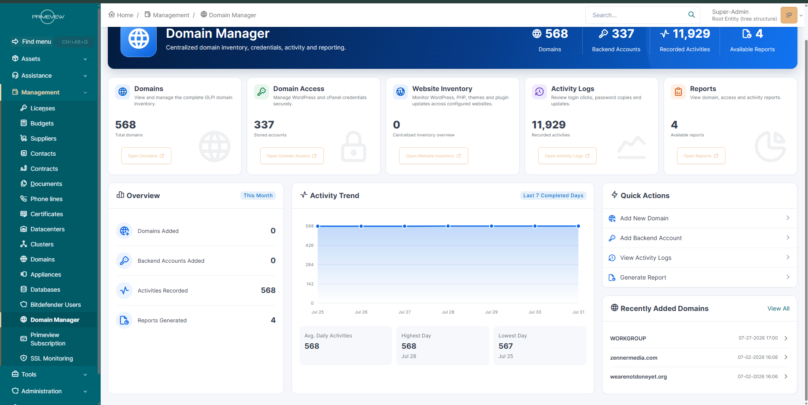
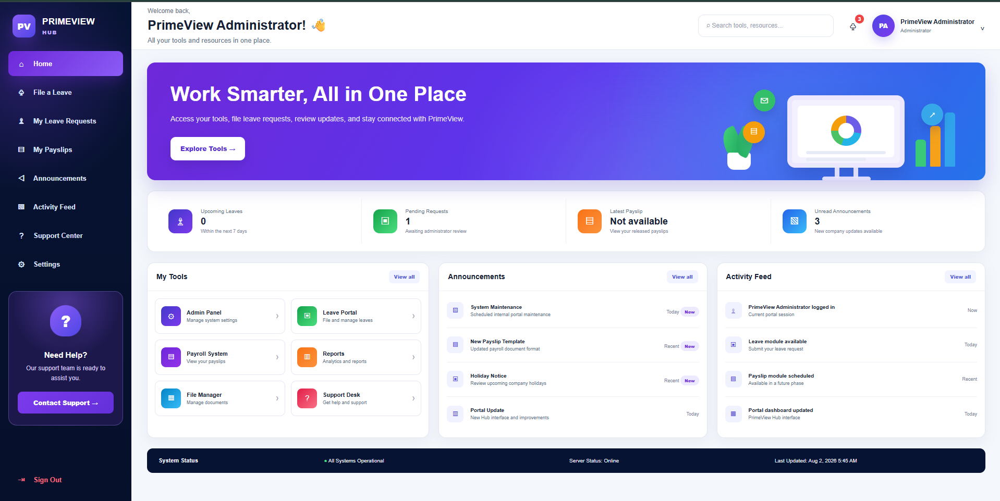
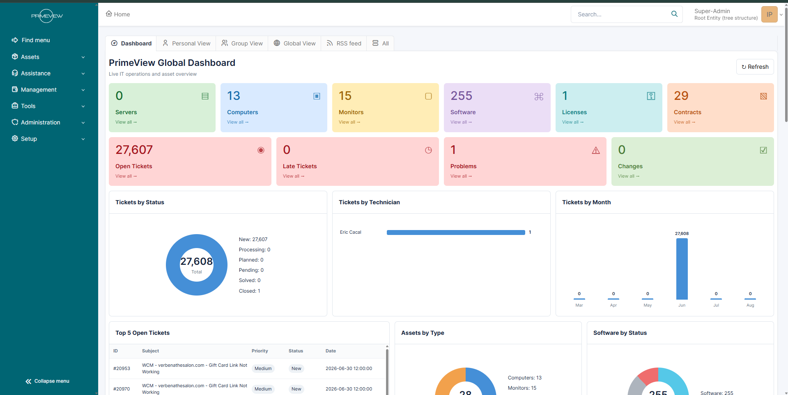
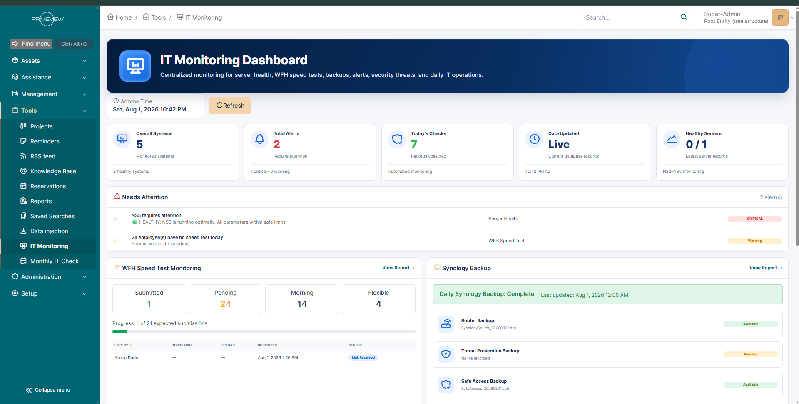
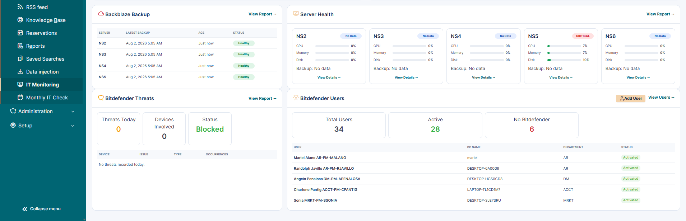
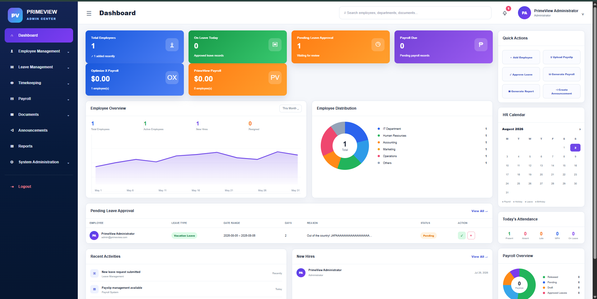
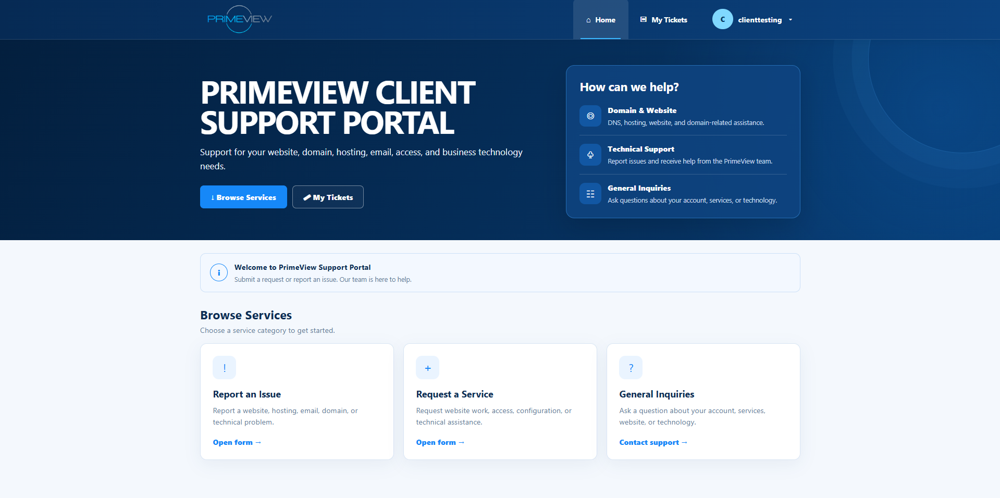

<!-- =========================================================
     RICO TORRES — PROFESSIONAL GITHUB PORTFOLIO
     GitHub: https://github.com/ricotorres-it
========================================================== -->

# Hi, I'm Rico Torres 👋

### Junior System Administrator

I support systems, servers, websites, and users by building reliable IT
solutions, automating routine processes, and improving operational visibility.

📍 San Jose Del Monte, Bulacan, Philippines

 

---

  <a href="#-about-me">About Me</a> •
  <a href="#-technical-skills">Skills</a> •
  <a href="#-featured-projects">Projects</a> •
  <a href="#-project-gallery">Screenshots</a> •
  <a href="#-work-experience">Experience</a> •
  <a href="#-certifications">Certifications</a> •
  <a href="#-contact">Contact</a>

---

# 👨‍💻 About Me

Junior System Administrator with experience supporting Linux servers,
Windows systems, WordPress websites, web-hosting environments, Google
Workspace, VPN access, backups, endpoint security, monitoring, and IT asset
management.

My work focuses on:

- Linux and Windows system support
- WordPress and web-hosting administration
- Server, website, and backup monitoring
- GLPI 11 development and customization
- IT automation and process improvement
- User onboarding and access management
- Technical troubleshooting and documentation
- Website security and performance monitoring

---

# 📊 Professional Highlights

<table>
<tr>

<td width="20%" align="center" valign="top">

### 90%

**Less manual IT-checking time**

Developed automated workstation inspection and reporting.

</td>

<td width="20%" align="center" valign="top">

### 50+

**Daily support tickets**

Handled requests through phone, email, and chat.

</td>

<td width="20%" align="center" valign="top">

### 85–90%

**First-contact resolution**

Resolved common system, software, and access issues.

</td>

<td width="20%" align="center" valign="top">

### 99%+

**Data accuracy**

Maintained and validated operational records.

</td>

<td width="20%" align="center" valign="top">

### 20%

**Workflow improvement**

Improved data-processing workflows using Excel.

</td>

</tr>
</table>

---

# 🧰 Technical Skills

<table>
<tr>

<td width="33%" valign="top">

## System Administration

- Linux
- Windows Server
- SSH
- MobaXterm
- Bash scripting
- PowerShell
- Windows Batch
- User provisioning
- Permission management
- Log analysis
- Backup monitoring
- Command-line troubleshooting

</td>

<td width="33%" valign="top">

## Web and Hosting

- WordPress
- cPanel and WHM
- Cloudflare
- GoDaddy
- WPMU DEV
- Apache
- LiteSpeed
- DNS administration
- SSL management
- Website backups
- Plugin and theme updates
- Website troubleshooting

</td>

<td width="33%" valign="top">

## Development

- PHP
- MySQL
- HTML
- CSS
- JavaScript
- jQuery
- REST APIs
- JSON
- Git
- GitHub
- Cron automation
- Technical documentation

</td>

</tr>

<tr>

<td width="33%" valign="top">

## Security and Access

- Bitdefender
- Wordfence
- Cloudflare security
- OpenVPN
- Tailscale
- Secure remote access
- Patch management
- Endpoint security
- AnyDesk
- Acronis Cyber Connect
- Bot protection
- Rate limiting

</td>

<td width="33%" valign="top">

## IT Management

- GLPI 11
- Asset management
- Ticket handling
- Incident logging
- SLA support
- Server inventory
- Subscription tracking
- User onboarding
- User offboarding
- Role-based access
- Process documentation

</td>

<td width="33%" valign="top">

## Monitoring and Business Tools

- UptimeRobot
- Synology Backup
- Backblaze
- Google Workspace
- Slack
- Teamwork
- Time Doctor
- Microsoft Excel
- SAP
- WMS
- Server-health monitoring
- Website-performance checks

</td>

</tr>
</table>

---

---

# 🚀 Featured Projects

## 🗄️ PrimeView GLPI IT Management System

Implemented and customized a GLPI 11 environment that centralizes IT
operations, asset management, support tickets, infrastructure monitoring,
website inventory, employee devices, backups, and administrative workflows.

### Main functions

- IT asset and server inventory
- Support-ticket management
- Server-health monitoring
- Website and domain inventory
- Monthly IT-check reporting
- Backup-status monitoring
- Employee-device mapping
- Bitdefender user monitoring
- Company subscription tracking
- Custom dashboards and reports
- Role-based access control
- Client support portal

### Technologies

---

## 💻 IT Monthly Check Automation

Developed a Windows-based automation script that performs routine workstation
and system inspections.

### Main checks

- DISM and SFC system validation
- Disk health and free-space checks
- Firewall and security-status checks
- Windows activation status
- Installed-program review
- Local-user inspection
- Temporary-file cleanup
- Restore-point checking
- Automatic report generation
- GLPI monthly-report integration

### Result

Reduced manual workstation inspection time by approximately **90%** and
improved the consistency of monthly IT reporting.

### Technologies

---

## 🌐 WordPress and Web-Hosting Administration

Managed WordPress websites and hosting environments using cPanel, Cloudflare,
GoDaddy, and WPMU DEV.

### Responsibilities

- WordPress core, plugin, and theme updates
- DNS configuration and troubleshooting
- SSL certificate management
- Website backups and restoration
- PHP and database troubleshooting
- Website-access management
- Performance monitoring
- Security monitoring
- Malware and bot mitigation
- Apache and LiteSpeed troubleshooting

---

## 🖥️ Linux Server Monitoring and Backup Management

Supported Linux-based hosting environments through SSH and command-line tools.

### Responsibilities

- Linux log review
- Server-health monitoring
- CPU, memory, and disk checks
- File and directory management
- File-permission troubleshooting
- Archive creation and extraction
- Backup-file transfers
- WHM backup monitoring
- Service-status checking
- Website uptime monitoring
- Incident investigation

---

# 🏢 PrimeView Platform Projects

## `inventory.primeview.com`

Central GLPI platform for IT operations, monitoring, asset management,
reporting, website inventory, and server-health records.

### My responsibilities

- Installed and configured GLPI 11
- Developed custom plugins
- Created custom database tables
- Built monitoring dashboards
- Connected automated scripts through APIs
- Created server-health workflows
- Customized menus and permissions
- Created technical documentation

---

## `admin.primeview.com`

Internal administration portal for employee management, timekeeping, leave,
payroll, documents, announcements, and reports.

### Main functions

- Employee-management workflows
- Leave approval and tracking
- Timekeeping administration
- Manual-time adjustments
- Payroll processing
- Payslip generation
- Documents and reports
- Administrative dashboards
- Company-based employee management

---

## `hub.primeview.com`

Employee self-service portal for accessing work records and submitting
internal requests.

### Main functions

- Employee dashboard
- Time records
- Leave requests
- Leave-status tracking
- Payslip access
- Manual-time requests
- Announcements
- Activity feed
- Employee profile
- Internal support access

---

## `clientportal.primeview.com`

Customized client-facing GLPI portal for technical support and service
requests.

### Main functions

- Report an Issue
- Request a Service
- General Inquiries
- My Tickets
- Ticket-status tracking
- Client account navigation
- Branded support interface
- Simplified request forms
- Custom `/pvhelpdesk` route

---

# 🧩 Custom GLPI Modules

<strong>🌐 Domain Manager</strong>

 

Centralized domain and website inventory.

### Features

- Domain inventory
- WordPress-version monitoring
- PHP-version monitoring
- Plugin and plugin-version inventory
- SSL-status monitoring
- Backend-access integration
- Activity logging
- Domain reporting
- WordPress REST API integration

<strong>🔐 Backend Access Manager</strong>

 

Administrative-access inventory connected to managed domains.

### Features

- WordPress login paths
- cPanel usernames
- Administrative usernames
- Masked-password fields
- Access notes
- Favorite records
- Livesite and devsite filtering

<strong>📡 IT Monitoring</strong>

 

Central monitoring module for infrastructure and operational checks.

### Features

- Server-health monitoring
- WHM backup monitoring
- WFH speed-test records
- Synology backup monitoring
- Backblaze monitoring
- Bitdefender threat records
- Automated health-check jobs
- Warning and critical alerts
- Automatic ticket creation

<strong>🩺 Monthly IT Check</strong>

 

Monthly workstation-inspection and reporting module.

### Features

- Automated report import
- Employee and computer mapping
- Healthy, warning, and critical statuses
- Monthly completion tracking
- Historical report records
- Device-name normalization
- Central reporting dashboard

<strong>🖥️ Servers and Server Health Records</strong>

 

Separate GLPI asset sections developed specifically for server infrastructure.

### Features

- Dedicated Servers menu
- Daily health records
- CPU, memory, and disk monitoring
- Service checks
- Backup-status history
- Important server notes
- Automated issue detection
- Historical monitoring results

<strong>🛡️ PrimeView IAM</strong>

 

Custom role-based access system for internal GLPI users.

### Features

- Module-level permissions
- Direct URL protection
- Sidebar-menu filtering
- Restricted page access
- Unauthorized-module hiding
- Centralized permission management
- Super-administrator bypass

### Supported roles

- Administrator
- IT
- Developer
- Sales
- Account Representative
- Virtual Assistant
- Digital Marketing
- Designer
- AI Specialist
- Accounting

<strong>💳 Company Subscription</strong>

 

Company subscription, payment, and renewal-monitoring module.

### Features

- Company subscription inventory
- Subscription-fee records
- Due-date monitoring
- Overdue detection
- Due-this-month reports
- Payment-status history
- CSV export
- Password-protected access
- Slack reporting
- `/pvstatus` command

<strong>📊 PrimeView Dashboard</strong>

 

Custom GLPI dashboard for operational information.

### Features

- Open-ticket summary
- Asset counts
- Software status
- Ticket charts
- Server-health information
- Website-monitoring information
- Backup-status information
- Monthly IT-check status
- Responsive dashboard cards

<strong>🛡️ Bitdefender Users</strong>

 

Centralized Bitdefender user and device inventory.

### Features

- Employee security records
- Device assignments
- CSV importing
- Employee and computer mapping
- Security-status visibility
- Monthly IT Check integration
- Search and filtering

<strong>🤖 WordPress Inventory Agent</strong>

 

WordPress agent that securely collects technical website information.

### Information collected

- WordPress version
- PHP version
- Installed plugins
- Plugin versions
- Website inventory information

The information is sent through a secured WordPress REST API and displayed in
the GLPI Domain Manager.

---

# 📷 Project Gallery

> The screenshots below are used for portfolio presentation. Confidential
> employee, client, credential, payroll, infrastructure, and account
> information should be removed or replaced with sample information before
> public publishing.

---

## 🌐 Domain Manager

Centralized domain inventory, backend-access management, website technical
information, activity logging, and reporting.

  

---

## 👥 PrimeView Employee Hub

Employee self-service interface for leave requests, payslips, announcements,
activity updates, and internal tools.

  

---

## 📊 PrimeView Global Dashboard

Central GLPI dashboard for tickets, assets, software, licenses, contracts,
problems, and operational reporting.

  

---

## 📡 IT Monitoring Dashboard

Centralized monitoring for server health, WFH speed-test submissions,
backups, alerts, security threats, and daily IT operations.

  

---

## 🛡️ Server Health and Security Monitoring

Monitoring interface for server resources, backup records, Bitdefender users,
security threats, and infrastructure status.

  

---

## 🏢 PrimeView Admin Center

Internal administration interface for employees, leave, timekeeping, payroll,
documents, announcements, and reports.

  

---

## 🎫 PrimeView Client Support Portal

Client-facing portal for reporting issues, requesting services, submitting
inquiries, and tracking support tickets.

  

---

# ⚙️ Automation and Integrations

<table>
<tr>

<td width="33%" valign="top">

## Server Automation

- Linux Bash scripts
- Cron jobs
- Server-health checks
- WHM backup verification
- Service-status monitoring
- Disk-space monitoring
- Automatic issue detection
- GLPI API submissions

</td>

<td width="33%" valign="top">

## Website Automation

- WordPress REST API
- Plugin inventory collection
- PHP-version collection
- WordPress-version collection
- SSL-status checking
- Website availability checking
- Domain inventory synchronization

</td>

<td width="33%" valign="top">

## Business Automation

- Slack status reports
- Company subscription notifications
- Monthly IT-check importing
- Employee-device mapping
- Automatic ticket creation
- Renewal tracking
- Monitoring dashboards
- Historical reporting

</td>

</tr>
</table>

---

# 💼 Work Experience

<strong>Junior System Administrator — Primeview</strong>

 

**July 2025 – Present**  
**Alabang, Metro Manila — Work from Home**

- Administer WordPress websites and web-hosting environments.
- Manage DNS, SSL certificates, website access, updates, backups, and security.
- Perform Linux server support using SSH and MobaXterm.
- Review logs, correct permissions, transfer backups, and extract archives.
- Monitor uptime, backups, server health, and website performance.
- Developed IT monthly-check automation that reduced manual checking time by
  approximately 90%.
- Implemented and customized GLPI for assets, tickets, server monitoring,
  Company subscription records, and administrative workflows.
- Developed internal administrator, employee, and client portals.

<strong>Technical Support Specialist — Civicom Pacific Corporation</strong>

 

**September 2024 – February 2025**

- Resolved more than 50 daily technical support tickets.
- Maintained an 85–90% first-contact resolution rate.
- Troubleshot software, system, account-access, and device problems.
- Configured user accounts, devices, and system access.
- Documented troubleshooting procedures and resolutions.
- Escalated complex incidents with complete diagnostics.

<strong>Data Management Specialist — Civicom Pacific Corporation</strong>

 

**April 2024 – June 2024**

- Maintained and validated operational datasets.
- Supported more than 99% accuracy in daily records.
- Improved Excel-based processing workflows.
- Increased processing efficiency by approximately 20%.
- Reviewed and corrected discrepancies before submission.

<strong>Data Entry Operator — Metro Mandaue Service Corporation</strong>

 

**August 2021 – January 2023**

- Managed inventory records using SAP and WMS.
- Updated stock movements and transaction information.
- Reconciled physical inventory against system records.
- Maintained an inventory discrepancy rate below 2%.
- Coordinated with warehouse and operations teams.

---

# 🎓 Education

## Information Technology — Applied Computer Engineering

**Imus Computer College**

**August 2023 – June 2025**

Training included:

- Computer systems servicing
- Networking fundamentals
- Server installation and configuration
- Hardware troubleshooting
- Operating-system installation
- Computer Systems Servicing NC II coursework

---

# 🏅 Certifications

<table>
<tr>

<td width="50%" valign="top">

## Microsoft and Cybersecurity

- Microsoft Office Specialist: Excel — Office 2016
- Introduction to Cybersecurity — Cisco Networking Academy
- Microsoft Cybersecurity: Security, Compliance, and Identity Fundamentals
- Cybersecurity and AI Safety Awareness for Employees
- Microsoft Excel — Beginner to Advanced
- Excel Analytics: Linear Regression Analysis

</td>

<td width="50%" valign="top">

## Networking and Systems

- Networking Basics — Cisco Networking Academy
- Networking Devices and Initial Configuration — Cisco Networking Academy
- Ultimate IT Networking Fundamentals Mastery Course
- Installing and Configuring Computer Systems — TESDA
- Setting Up Computer Networks — TESDA
- Setting Up Computer Servers — TESDA

</td>

</tr>
</table>

---

# 📈 GitHub Activity

 

---

# 🔄 My Technical Work Process

<pre>
Identify and document the issue
               ↓
Back up the affected system
               ↓
Review logs and configurations
               ↓
Develop and implement the solution
               ↓
Test functionality and security
               ↓
Monitor the result
               ↓
Create technical documentation
</pre>

---

# 🔒 Portfolio Security Notice

This public portfolio does not intentionally include:

- Passwords
- API keys
- Server credentials
- Private IP addresses
- Employee personal information
- Client personal information
- Payroll information
- Private databases
- Production configuration files
- Complete proprietary source code
- Confidential company records

All project screenshots and examples should be reviewed and sanitized before
public publication.

---

# 📫 Contact

I am interested in opportunities involving:

### Junior System Administration
### IT Support and Technical Operations
### Linux and Web-Hosting Administration
### WordPress Administration
### IT Automation and Infrastructure Monitoring

 

  

### Thank you for visiting my portfolio.

